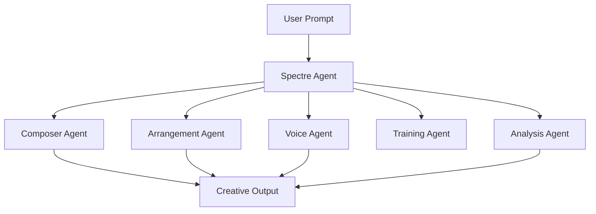

⭐ Star the repo if you want to see MurMur grow.
# MURMUR : A Learning Constellation

In MurMur, the Spectre Agent is the silent observer —
the intelligence that listens to all agents and
guides the constellation toward coherent creation.

## MurMur Constellation Architecture




## System Overview

Prompt
   ↓
God Agent
   ↓
Composer Agent → Arrangement Agent → Voice Agent
   ↓
Music Output

Multi-agent AI system for generative music, analysis, and creative orchestration.

## Features
- AI Music Generation
- Multi-Agent Architecture
- Studio CLI Interface
- Training Pipeline

## Quick Start


```bash

git clone https://github.com/yourname/murmur-mvp
cd murmur-mvp
pip install -r requirements.txt
python music_ai_studio.py
```

**Built with MurMurLove 🎵 for music creators and AI enthusiasts**
